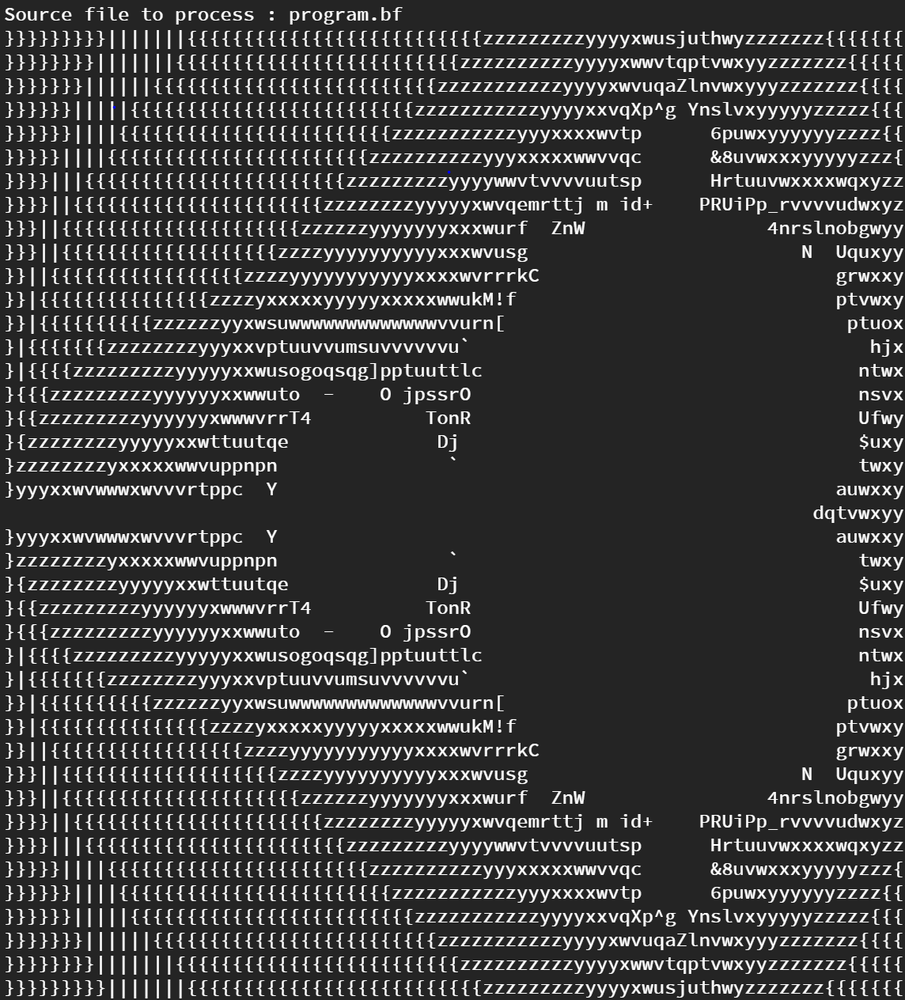

# BefungeInterpreter
A Befunge interpretter written in native Python

## How to use ?

Simply type :

	ask_and_process_befunge_file()

## Example

## About

This interpreter relies on Befunge specifications found here : <a href="https://esolangs.org/wiki/Befunge">Esolang Befunge Specifications</a>
